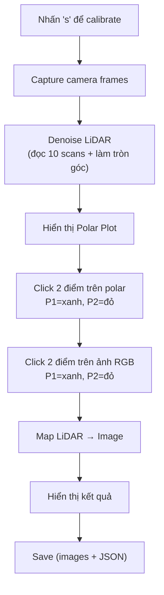

# Tóm Tắt Các Thay Đổi trong collect_calibration.py

## 🎯 Mục Tiêu
1. **Lọc nhiễu LiDAR**: Dùng kỹ thuật đọc nhiều lần + làm tròn góc
2. **Chuyển tọa độ**: Từ Polar (góc, khoảng cách) sang Cartesian (x, z)
3. **Thay đổi UI**: Chọn điểm trực tiếp trên polar plot (thay vì scatter plot)

---

## 📋 Các Hàm Mới Được Thêm

### 1. `denoise_lidar_scans(num_scans=10)`
**Mục đích**: Lọc nhiễu dữ liệu LiDAR  
**Cách hoạt động**:
- Lấy 10 scan gần nhất từ buffer (được tích lũy bởi thread LiDAR)
- Làm **tròn góc** đến độ nguyên gần nhất (ví dụ: 1.2° → 1°, 2.7° → 3°)
- Tính **trung bình khoảng cách** cho mỗi góc
- Trả về danh sách điểm đã lọc nhiễu

**Output**:
```
Denoised points: 180 (from 10 scans)
```

### 2. `polar_to_cartesian(angle_deg, distance_mm)`
**Mục đích**: Chuyển tọa độ từ cực sang Cartesian  
**Công thức**:
- $x = distance \times \sin(angle)$ (ngang: dương=phải, âm=trái)
- $z = distance \times \cos(angle)$ (sâu: hướng phía trước)

**Ví dụ**:
```python
x, z = polar_to_cartesian(45, 1000)  # (707.1, 707.1) mm
```

### 3. `select_bar_points_polar(scan_data, ...)`
**Mục đích**: Chọn 2 đầu thanh trực tiếp trên polar plot  
**Cách sử dụng**:
1. Hiển thị polar plot với điểm đã lọc nhiễu
2. Click P1 (đầu trái của thanh) → **xanh lá**
3. Click P2 (đầu phải của thanh) → **đỏ**
4. Nhấn **Enter** để xác nhận

**Output**: Trả về các điểm trong dãy góc giữa P1 và P2

---

## 🔄 Quy Trình Calibration (Mới)



---

## 📊 Dữ Liệu Lưu trong JSON

### Thêm các trường mới:
```json
{
  "timestamp": 1773037223128,
  "denoising_method": "multiple_scans_rounded_angles",
  "denoising_scans_count": 10,
  "cartesian_points": [
    {
      "angle": 10,
      "distance": 1500,
      "x": 260.4,
      "z": 1477.4
    },
    ...
  ],
  "mapped_points": [...]
}
```

---

## 🔧 Thay Đổi Kỹ Thuật

### Global Variables
```python
# Cũ
latest_filtered = []

# Mới
latest_filtered = []
scans_buffer = []  # Tích lũy scans để lọc nhiễu
```

### lidar_thread()
```python
# Cũ: Chỉ giữ scan mới nhất
latest_filtered = filtered

# Mới: Cũng tích lũy vào buffer
latest_filtered = filtered
scans_buffer.append(filtered)
```

### calibrate()
```python
# Cũ
bar = select_bar_points(scan_data, ...)

# Mới
denoised = denoise_lidar_scans(num_scans=10)
bar = select_bar_points_polar(denoised, ...)
```

---

## 📈 Ưu Điểm Của Chiến Lược Này

| Vấn đề | Cách Giải Quyết | Lợi Ích |
|-------|-----------------|---------|
| Nhiễu LiDAR | Đọc 10 lần + làm tròn góc | Độ chính xác cao, dễ thường đơn giản |
| Chọn điểm khó | Polar plot interactif | Trực quan hơn, dễ chọn chính xác |
| Tọa độ không rõ ràng | Lưu Cartesian | Tiện cho xử lý sau |

---

## 🧪 Kiểm Tra

Khi chạy, bạn sẽ thấy:
```
Initializing LIDAR...
Initializing RealSense Camera...
Starting main loop. Press "s" to calibrate, Ctrl+C to quit

===== Calibration #1 =====
--- Denoising LiDAR data ---
  Denoising using 10 scans...
  Denoised points: 180 (from 10 scans)

--- Select bar points on Denoised LiDAR (Polar) ---
  (Hiển thị polar plot - click chọn 2 điểm)
  Bar range: -45° to 45° (91 points)
    P1: angle=-45°, dist=1500mm, cartesian=(-1060.7, 1060.7)
    P2: angle=45°, dist=1500mm, cartesian=(1060.7, 1060.7)

--- Click P1 (left) and P2 (right) on the bar, then Enter ---
  (Hiển thị ảnh RGB - click chọn 2 điểm)
  P1: (200, 300)
  P2: (440, 300)

--- Result shown. Press Enter to continue ---
  Saved to data/captured_data/ (timestamp: 1773037223128)
-> Done #1
```

---

## ❓ Câu Hỏi Thường Gặp

**Q: Tại sao làm tròn góc lại lọc được nhiễu?**  
A: Vì nhiễu LiDAR thường là những giá trị góc lẻ (1.2°, 2.7°). Bằng cách làm tròn và tính trung bình, ta loại bỏ những điểm nhiễu đơn lẻ.

**Q: 10 scans có đủ không?**  
A: Có thể điều chỉnh `num_scans=10` thành số khác nếu cần. Nhiều scans hơn = nhiễu ít hơn nhưng mất thời gian lâu hơn.

**Q: Vì sao dùng Cartesian?**  
A: Cartesian (x, z) dễ hơn cho các bước xử lý tiếp theo (compute_calibration.py dùng chuẩn này).

---

## 📝 Lưu Ý
- **Thread-safe**: Dùng `scan_lock` để bảo vệ `scans_buffer` khỏi race conditions
- **Backward compatible**: Những hàm cũ (như `select_bar_points`) vẫn tồn tại, chỉ không dùng
- **JSON mở rộng**: Các trường cũ vẫn giữ, thêm fields mới cho metadata lọc nhiễu + Cartesian
